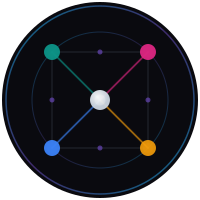

<p align="center">
  
</p>

# ZK Agentic Network

[](https://github.com/onetrueclaude-creator/Exodus/actions/workflows/ci.yml)
[](LICENSE)
[](https://zkagentic.ai)

A gamified social media dApp where users explore a 2D Neural Lattice, communicate through AI agents, develop nodes, and build diplomatic relationships — all backed by the Agentic Chain testnet blockchain.

[Whitepaper (v1.0)](spec/whitepaper.md) | [Roadmap](ROADMAP.md) | [Live Testnet Monitor](https://zkagentic.ai) | [Marketing](https://zkagentic.com) | [Security Policy](SECURITY.md)

## Architecture

```
Exodus/
├── chain/              Python FastAPI testnet (consensus, mining, tokenomics)
├── apps/game/          Next.js 16 game client (React 19, PixiJS 8, Zustand 5)
├── web/
│   ├── marketing/      zkagentic.com — static landing site (GitHub Pages)
│   └── monitor/        zkagentic.ai — live testnet dashboard (Cloudflare Pages)
├── spec/               Whitepaper v1.0, audit reports, research, product specs
├── docs/               Design documents and implementation plans
├── tests/              E2E tests (Playwright)
├── supabase/           Database migrations
└── public/             Static assets
```

## Quick Start

### Chain (testnet API)

```bash
cd chain
pip3 install -r requirements.txt
python3 -m uvicorn agentic.testnet.api:app --port 8080
# API at http://localhost:8080 | Swagger at http://localhost:8080/docs
```

### Game UI

```bash
cd apps/game
npm install
docker compose up -d         # PostgreSQL for auth
npx prisma migrate dev       # Apply database schema
npm run dev                  # http://localhost:3000
```

### Run Tests

```bash
# Chain (Python)
cd chain && python3 -m pytest tests/ -v          # 800+ tests

# Game UI (TypeScript)
cd apps/game && npm test                          # Vitest (watch mode)

# E2E
npx playwright test                               # Playwright
```

## Protocol

ZK Agentic Chain uses **Proof of AI Verification (PoAIV)** — a consensus mechanism where 13 AI verification agents per block require 9/13 supermajority attestation. Key protocol parameters:

| Parameter | Value |
|-----------|-------|
| Block time | 60s |
| Verifiers per block | 13 (9/13 threshold) |
| Staking weights | 40% token / 60% CPU |
| Fee burn | 50% |
| Inflation ceiling | 5% annual |
| Genesis supply | 900 AGNTC |

Full protocol specification: [`spec/whitepaper.md`](spec/whitepaper.md)

## Domains

| Domain | What | Source |
|--------|------|--------|
| [zkagentic.com](https://zkagentic.com) | Marketing + whitepaper | `web/marketing/` |
| [zkagentic.ai](https://zkagentic.ai) | Live testnet monitor | `web/monitor/` |
| [zkagenticnetwork.com](https://zkagenticnetwork.com) | Game UI (Phase 3) | `apps/game/` |

## Phase 2: Public Testnet (current)

The testnet miner runs locally and syncs to Supabase via write-through architecture:

```
User action → Supabase (pending_transactions) → Local miner polls → Processes → Syncs back
```

No public API hosting required. The monitor reads from Supabase Realtime subscriptions.

## Token

**AGNTC** — native token, initially deployed as Solana SPL token (1B supply). The development roadmap culminates in migration to an independent L1 via a lock-and-mint bridge.

Mint address: `3EzQqdoEEbtfdf8eecePxD6gDd1FeJJ8czdt8k27eEdd`

## Contributing

See [CONTRIBUTING.md](CONTRIBUTING.md) for setup instructions and PR conventions. Please read our [Code of Conduct](CODE_OF_CONDUCT.md).

## License

[MIT](LICENSE)
